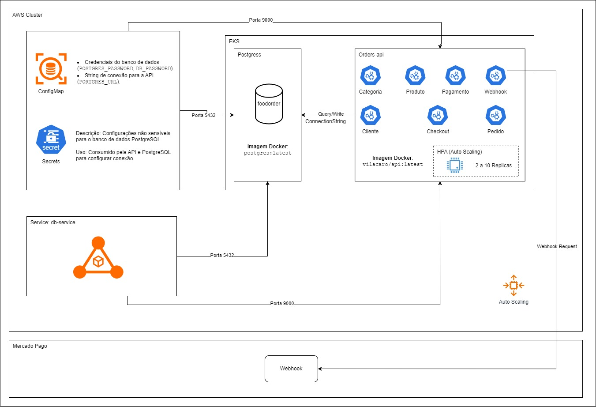

# Arquitetura do Projeto FoodOrder

Este projeto utiliza uma arquitetura baseada em Kubernetes, implementada em um cluster AWS EKS (Elastic Kubernetes Service). Abaixo está uma descrição detalhada dos componentes:

## Componentes

### **1. ConfigMap**
- **Função**: Armazena configurações não sensíveis utilizadas pelo banco de dados PostgreSQL e pela API.
- **Dados armazenados**:
  - `POSTGRES_DB`: Nome do banco de dados.
  - `POSTGRES_USER`: Usuário do banco de dados.
  - `DB_NAME`: Nome do banco de dados utilizado pela API.
  - `DB_USER`: Usuário utilizado pela API.

### **2. Secrets**
- **Função**: Armazena informações sensíveis, como credenciais e strings de conexão.
- **Dados armazenados**:
  - `POSTGRES_PASSWORD`: Senha do banco de dados (codificada em Base64).
  - `DB_PASSWORD`: Senha adicional para conexão segura (codificada em Base64).
  - `PORTGRES_URL`: String de conexão completa para a API e o banco de dados.

### **3. Service (db-service)**
- **Função**: Expõe o banco de dados PostgreSQL e a API dentro do cluster.
- **Portas**:
  - Porta `5432`: Banco de dados PostgreSQL.
  - Porta `9000`: API.

### **4. PostgreSQL**
- **Descrição**: Banco de dados relacional utilizado para armazenar as informações da aplicação.
- **Imagem Docker**: `postgres:latest`.

### **5. Orders-API**
- **Descrição**: API responsável pelo processamento de pedidos, categorias, produtos, clientes e integração com o Mercado Pago.
- **Componentes**:
  - Módulos: Categoria, Produto, Pagamento, Webhook, Cliente, Checkout, Pedido.
  - Integração com o Mercado Pago via Webhook.
- **Imagem Docker**: `vilacaro/api:latest`.

### **6. Auto Scaling (HPA)**
- **Descrição**: Mecanismo de autoescalonamento baseado em utilização de CPU.
- **Configurações**:
  - Réplicas mínimas: `2`.
  - Réplicas máximas: `10`.
  - Utilização média-alvo: `70%`.

### **7. Integração com o Mercado Pago**
- **Descrição**: A API processa notificações enviadas pelo Webhook do Mercado Pago.

## Fluxo Geral

1. **Configuração**:
   - Configurações sensíveis e não sensíveis são gerenciadas por Secrets e ConfigMap, respectivamente.
2. **Banco de Dados**:
   - O PostgreSQL armazena os dados da aplicação, acessados pela API via string de conexão segura.
3. **API**:
   - A API processa requisições dos módulos internos e interage com o Webhook do Mercado Pago.
4. **Auto Scaling**:
   - O HPA ajusta dinamicamente o número de réplicas da API de acordo com a carga de CPU.

## Tecnologias Utilizadas
- **Kubernetes**: Gerenciamento de containers.
- **AWS EKS**: Cluster Kubernetes gerenciado na AWS.
- **PostgreSQL**: Banco de dados relacional.
- **Docker**: Empacotamento de aplicações em containers.
- **Mercado Pago**: Serviço de integração de pagamentos.

---

Este diagrama e descrição refletem a arquitetura atual do projeto e foram projetados para garantir escalabilidade, segurança e integração eficiente.
