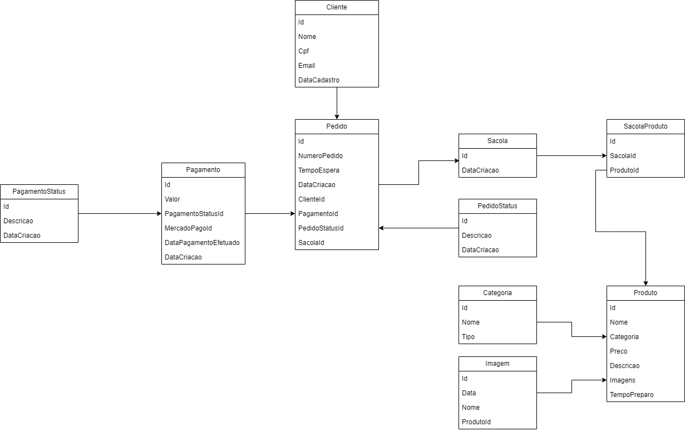

# Documentação do Schema de Banco de Dados

## Visão Geral

```
Este documento descreve o banco de dados para a aplicação. A modelagem foi feita com base nas entidades principais e seus relacionamentos, buscando garantir integridade dos dados e eficiência nas consultas.
```

## UML



## Entidades

### Cliente

- Id: Identificador único do cliente.
- Nome: Nome completo do cliente.
- Cpf: CPF do cliente (campo único).
- Email: Email do cliente.
- DataCadastro: Data do registro do cliente.

### Pedidos

- Id: Identificador único do pedido.
- NumeroPedido: Número sequencial do pedido.
- TempoEspera: Tempo estimado de espera.
- DataCriacao: Data em que o pedido foi criado.
- ClienteId: Referência ao cliente que fez o pedido.
- PagamentoId: Referência ao pagamento associado ao pedido.
- PedidoStatusId: Status atual do pedido.
- SacolaId: Referência à sacola de produtos associada ao pedido.

### Pagamento

- Id: Identificador único do pagamento.
- Valor: Valor total do pagamento.
- PagamentoStatusId: Status do pagamento (pago, pendente, etc).
- MercadoPagoId: Identificação do pagamento no gateway MercadoPago.
- DataPagamentoEfetuado: Data em que o pagamento foi concluído.
- DataCriacao: Data de criação do registro de pagamento.

### PagamentoStatus

- Id: Identificador único do status de pagamento.
- Descricao: Descrição do status (Ex: Pago, Pendente, Cancelado).
- DataCriacao: Data de criação do status.

### PedidoStatus

- Id: Identificador único do status do pedido.
Descricao: Descrição do status (Ex: Em preparo, Enviado, Entregue).
- DataCriacao: Data de criação do status.

### Sacola

- Id: Identificador único da sacola.
- DataCriacao: Data de criação da sacola.

SacolaProduto

- Id: Identificador único.
- SacolaId: Referência à sacola associada.
- ProdutoId: Referência ao produto associado.

### Produto

- Id: Identificador único do produto.
- Nome: Nome do produto.
- Categoria: Referência à categoria do produto.
- Preco: Preço do produto.
- Descricao: Descrição detalhada do produto.
- Imagens: Lista de imagens associadas ao produto.
- TempoPreparo: Tempo estimado de preparo do produto.

### Categoria

- Id: Identificador único da categoria.
- Nome: Nome da categoria.
- Tipo: Tipo de categoria.

### Imagem

- Id: Identificador único da imagem.
- Data: Data de adição da imagem.
- ProdutoId: Referência ao produto associado à imagem.

## Relacionamentos

Cliente → Pedidos: Um cliente pode ter vários pedidos.

Pedido → Pagamento: Um pedido possui um pagamento associado.

Pedido → PedidoStatus: Um pedido tem um status.

Sacola → SacolaProduto: Uma sacola contém vários produtos.

Produto → Categoria: Cada produto pertence a uma categoria.

Produto → Imagem: Um produto pode ter várias imagens.

## Otimização de Consultas

Índices: Índices em campos frequentemente usados em filtros e joins, como ClienteId, PedidoStatusId e Categoria.

Normalização: O schema evita redundância de dados.

Consultas com JOINs: Usa JOINs para carregar dados relacionados em uma única consulta ao invés de múltiplas requisições.

## Boas Práticas de Modelagem

Chaves Primárias e Estrangeiras: Usadas para garantir a integridade dos dados com uso consistente de chaves primárias e estrangeiras.

Nomes Descritivos: Nomes de tabelas e colunas claros e descritivos para facil entendimento do uso.

## Uso do Entity Framework

O banco de dados foi criado e é gerenciado utilizando o Entity Framework (EF), um ORM (Object Relational Mapper) para .NET.

Por que usar o Entity Framework?

Abstração da camada de dados: Permite focar mais na lógica da aplicação e menos no SQL puro.

Migrations: Facilita a evolução do banco de dados com controle de versões.

Consultas mais legíveis: Usa LINQ para construir queries de maneira mais intuitiva.

Mapeamento de relacionamentos: Define as relações entre entidades diretamente no código C#.

Agilidade no desenvolvimento: Menos tempo gasto escrevendo queries e manipulação de dados.

Com o EF, é possível criar o schema inteiro baseado nas classes (Code First) ou gerar classes a partir de um banco já existente (Database First). Ele também gerencia automaticamente transações e conexões, simplificando o código e reduzindo erros comuns.

## PostgreSQL na AWS

O PostgreSQL foi escolhido para ser hospedado na AWS pelos seguintes motivos:

- Alta Disponibilidade: Com serviços como Amazon RDS ou Aurora, o banco fica replicado automaticamente entre zonas de disponibilidade.
- Escalabilidade: A infraestrutura da AWS permite escalar tanto vertical quanto horizontalmente.
- Backups Automatizados: AWS oferece snapshots e backups contínuos.
- Segurança: Controle de acesso granular, criptografia em trânsito e em repouso.
- Monitoramento: Integrações com CloudWatch e ferramentas de diagnóstico.
- Manutenção Simplificada: AWS gerencia atualizações de versão, failovers e patching.

Essa abordagem combina robustez, flexibilidade e gestão facilitada para suportar cenários de crescimento e alta carga.