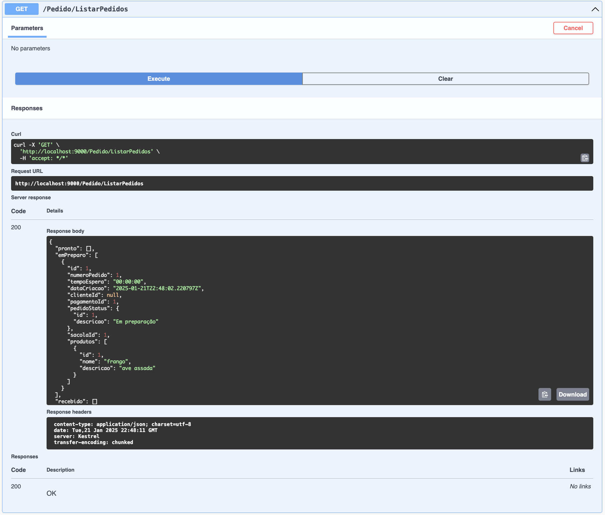

# Documentação para FakeCheckout

Este guia descreve os passos necessários para realizar um fake checkout e listar os pedidos em nosso sistema. Para cada passo, é fornecido um exemplo de JSON ou Print da tela de entrada ou saída, junto com uma descrição do processo.

## Requisitos
- Ter realizado os passos de Cadastro de Produto: 
[README de cadastro de produto](./Readme/README_PRODUTO.md)


## Índice
- [Passo 1: Cadastrar Cliente](#passo-1-cadastrar-cliente)
- [Passo 2: Consultar Cliente](#passo-2-consultar-cliente)
- [Passo 3: Fake Checkout sem CPF](#passo-3-fake-checkout-sem-cpf)
- [Passo 4: Fake Checkout com CPF](#passo-4-fake-checkout-com-cpf)
- [Passo 5: Listar Pedidos](#passo-5-listar-pedidos)

---


### Passo 1: Cadastrar Cliente

Para cadastrar um cliente é obrigatório informar os campos de cpf, nome e e-mail. Abaixo o JSON de exemplo para cadastrar um cliente. 

**JSON de Exemplo:**

```json
{
  "cpf": "000.000.001-91",
  "nome": "Nome 1",
  "email": "email@mail.com"
}

```

#### Cadastrar Cliente:


---


### Passo 2: Consultar Cliente

Para consultar um cliente basta informar um cpf. No exemplo abaixo utilizamos o cpf: <code>000.000.001-91</code>. 

#### Consulta Cliente:


---


### Passo 3: Fake Checkout sem CPF

Para realizar um fake checkout é obrigatório informar um ou mais produtos passando o Id de cada Produto escolhido, e um CPF caso o usuário tenha se identificado. Abaixo está um exemplo de JSON para realizar o fake checkout sem "cpf" e com um produto "churros".

**JSON de Exemplo:**

```json
{
  "cpf": "string",
  "produtos": [
    1
  ]
}

```

#### Checkout sem CPF:


---


### Passo 4: Fake Checkout com CPF

Para realizar um fake checkout é obrigatório informar um ou mais produtos passando o Id de cada Produto escolhido, e um CPF caso o usuário tenha se identificado. Abaixo está um exemplo de JSON para realizar o fake checkout com "cpf" e com 2 produtos "churros".

**JSON de Exemplo:**

```json
{
  "cpf": "000.000.001-91",
  "produtos": [
    1, 1
  ]
}

```

#### Checkout com CPF:


---

### Passo 5: Listar Pedidos

Neste passo, você pode listar os pedidos criados no sistema. O JSON de retorno esperado incluir os detalhes de cada pedido.

#### Pedidos:



#### Exemplo de JSON de Retorno:

```json
[
  {
    "id": 1,
    "numeroPedido": 1,
    "tempoEspera": "00:20:00",
    "dataCriacao": "0001-01-01T00:00:00",
    "clienteId": null,
    "pagamentoId": 1,
    "pedidoStatusId": 1,
    "sacolaId": 1,
    "produtos": [
      {
        "id": 1,
        "nome": "churros",
        "descricao": "15 mini churros"
      }
    ]
  },
  {
    "id": 2,
    "numeroPedido": 2,
    "tempoEspera": "00:40:00",
    "dataCriacao": "0001-01-01T00:00:00",
    "clienteId": "dd96b089-01e8-4e08-8927-5ad087f79c75",
    "pagamentoId": 2,
    "pedidoStatusId": 1,
    "sacolaId": 2,
    "produtos": [
      {
        "id": 1,
        "nome": "churros",
        "descricao": "15 mini churros"
      },
      {
        "id": 1,
        "nome": "churros",
        "descricao": "15 mini churros"
      }
    ]
  }
]
```
---

Este README documenta o processo básico de checkout e consulta de pedidos em nosso sistema de forma clara e objetiva.

