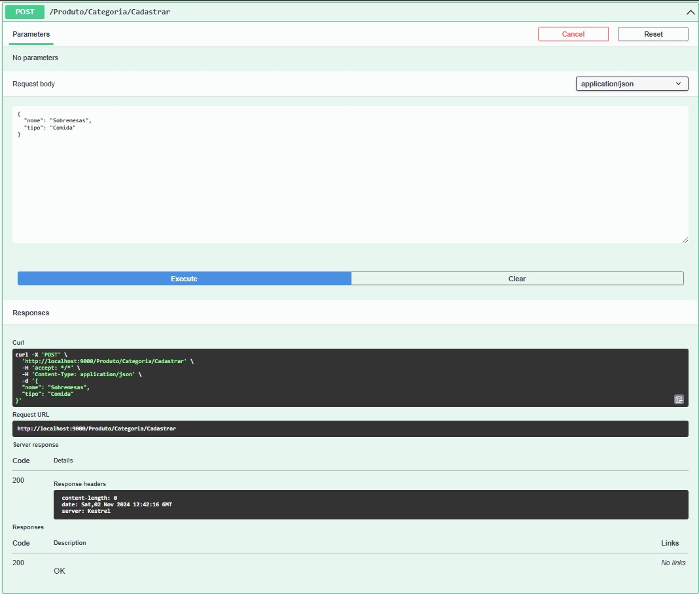
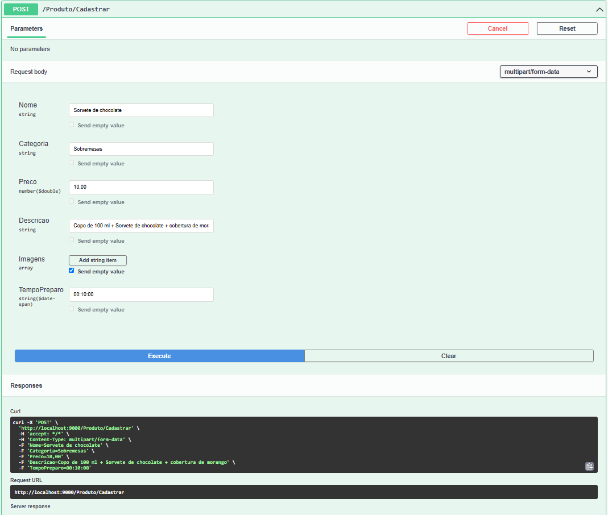
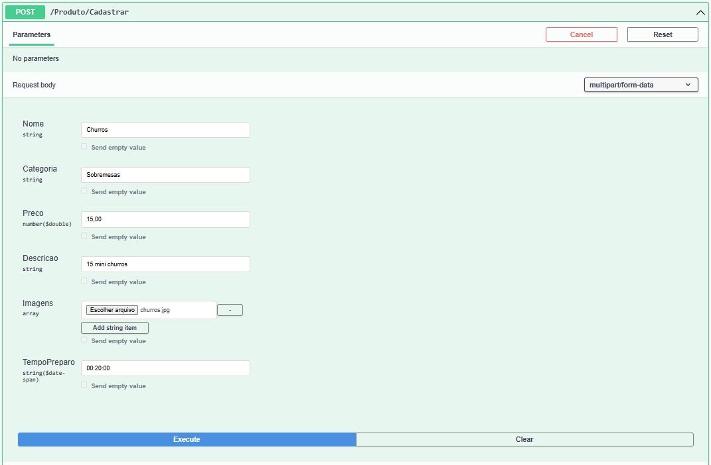
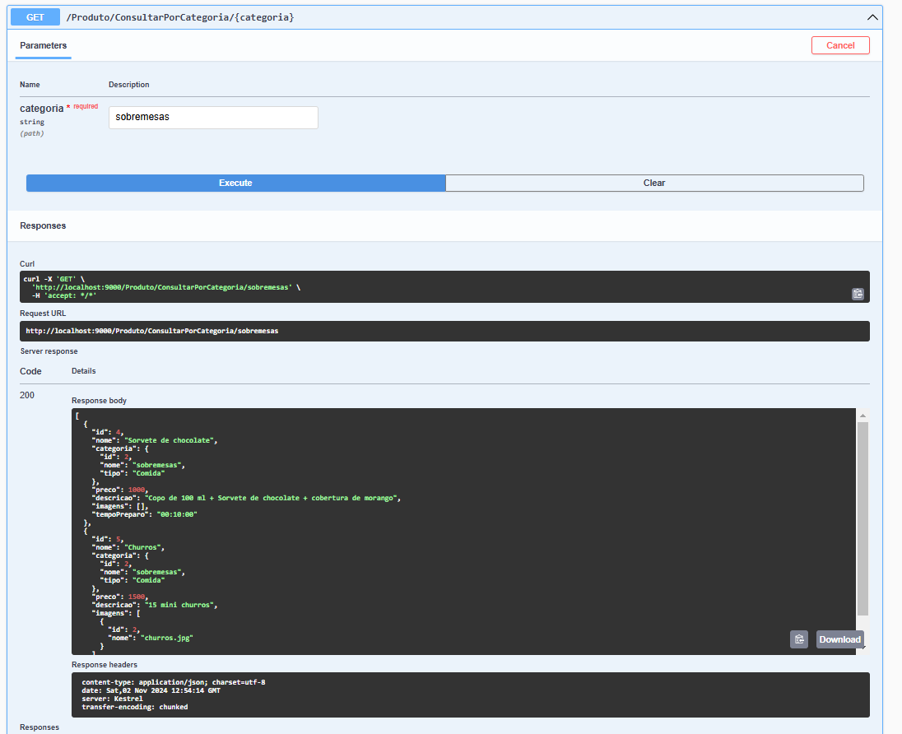

# Documentação de Cadastro de Produtos

Este guia descreve os passos necessários para cadastrar e consultar produtos em nosso sistema. Para cada passo, é fornecido um exemplo de JSON ou Print da tela de entrada ou saída, junto com uma descrição do processo.

## Índice
- [Passo 1: Cadastrar Categoria](#passo-1-cadastrar-categoria)
- [Passo 2: Salvar Produto com ou sem Categoria](#passo-2-salvar-produto-com-ou-sem-categoria)
- [Passo 3: Consultar por Categoria](#passo-3-consultar-por-categoria)

---

### Passo 1: Cadastrar Categoria

O primeiro passo para cadastrar um produto é criar uma categoria que o organize. Abaixo está um exemplo de JSON para cadastrar uma categoria de "Sobremesas" com o tipo "Comida".

**JSON de Exemplo:**

```json
{
  "nome": "Sobremesas",
  "tipo": "Comida"
}

```

#### Cadastro de categoria:



---

### Passo 2: Salvar Produto com ou sem Categoria

Neste passo, você pode cadastrar um novo produto, associando-o a uma categoria previamente criada. Os detalhes do produto, como nome, preço e descrição, devem ser preenchidos de acordo com as necessidades do sistema.

#### Cadastro de produto sem imagem:



#### Cadastro de produto com imagem:



#### Imagem usada:


---

### Passo 3: Consultar por Categoria

Para visualizar todos os produtos de uma categoria específica, você pode realizar uma consulta por categoria. O JSON de retorno esperado inclui os detalhes dos produtos, como id, nome, categoria, preço, descrição, imagens e tempoPreparo.

#### Imagem usada:



#### Exemplo de JSON de Retorno:

```json
[
  {
    "id": 4,
    "nome": "Sorvete de chocolate",
    "categoria": {
      "id": 2,
      "nome": "sobremesas",
      "tipo": "Comida"
    },
    "preco": 10,
    "descricao": "Copo de 100 ml + Sorvete de chocolate + cobertura de morango",
    "imagens": [],
    "tempoPreparo": "00:10:00"
  },
  {
    "id": 5,
    "nome": "Churros",
    "categoria": {
      "id": 2,
      "nome": "sobremesas",
      "tipo": "Comida"
    },
    "preco": 15,
    "descricao": "15 mini churros",
    "imagens": [
      {
        "id": 2,
        "nome": "churros.jpg"
      }
    ],
    "tempoPreparo": "00:20:00"
  }
]
```

---

Este README documenta o processo básico de cadastro e consulta de produtos em nosso sistema de forma clara e objetiva.

